# rt-haskell

A Path Tracer in Haskell

We follow mostly the P. Shirley's architecture with couple of differences.

The branches follow the chapters from [online](raytracing.github.io/)
repository.

## Show case

- Small color gradient in 01-ppm branch:

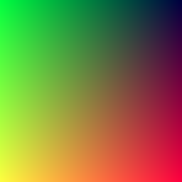

- Red sphere from 04-sphere branch:

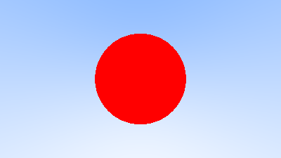

- Normals from branch 05-surface:

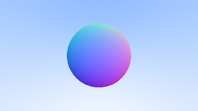

- Multiple objects from branch 06-multiple:

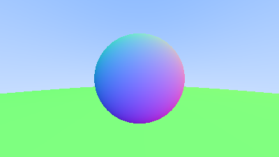

- Antialiasing from branch 07-antialias:

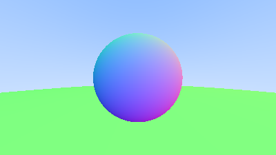

- Diffuse image from branch 08-diffuse

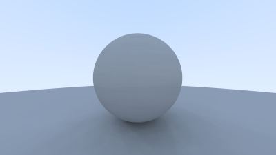

- Metal image from branch 09-metal

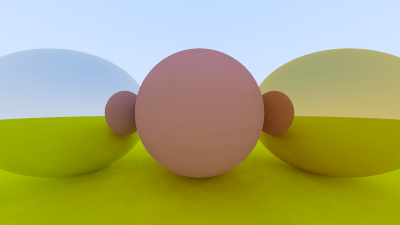

- Fuzzy metal image from branch 09-metal

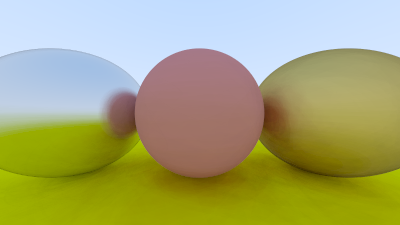

- Dielectric from branch 10-dielectric

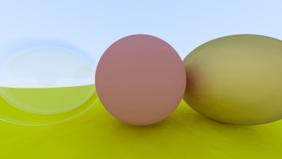

- Camera focus from branch 11-camera

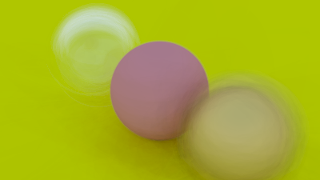

- A version of final scene from branch 12-oneweekend

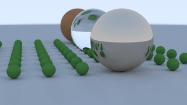

- Another version of final scene branch 12-oneweekend

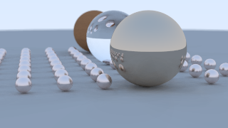

- Fixed version of final scene. The fix happens around branch 14-texture

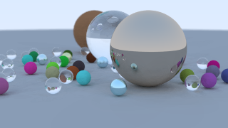

- Final one weekend final branch 14-texture

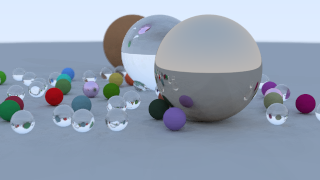

- Motion blur branch 14-texture

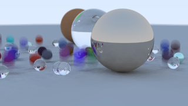

- Checkered texture from branch 14-texture

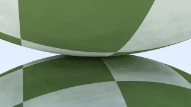

- Perlin Noise with Light from branch 14-texture

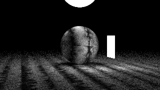

- Earth image from branch 14-texture

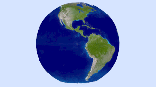

- Cornell box image from branch 15-instances

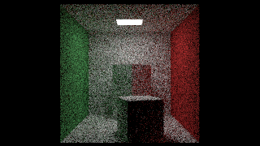

## Some Notes on Performance

The from branch 08-diffuse an onwards as the usage of random functions become
prominent the performance decreases considerably. However the inverse is also
true, if you can place your random generators efficiently, you can easily
increase your performance. I simply concentrated on getting the images right.
Do not be surprised if you find that some other arrangement of RNGs result in
better performance.

## Planned Features

I hope to make the tracer as minimal but useful as possible.
Here is a list of planned features:

- Loading assets with obj files
- Spectral rendering switch
- BVH acceleration structure: done but not tested.
- Multithreaded rendering: This is as easy as passing -N3 as option now, since
  most of the code is composed of pure functions.
